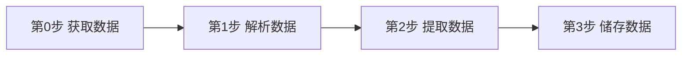
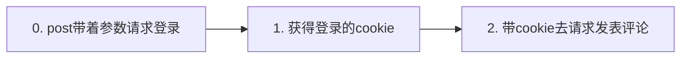
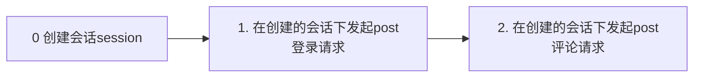
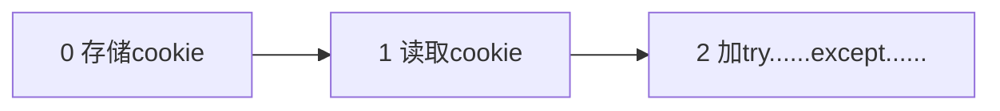
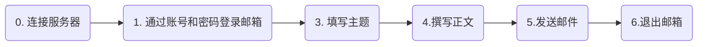
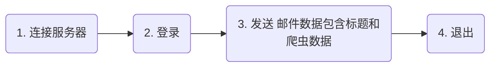

# 爬虫知识整理

[TOC]


⭐️前面的一些难点，助教也做好了讲解的文档啦，同学们可以收藏一下：
https://shimo.im/docs/8P3pJjtRH886DTyr/ 《第1关-课堂内html运行空白问题》
https://shimo.im/docs/hXrXKG8d8gK3XRCw/ 《第2关-爬取蜘蛛侠网评论》
https://shimo.im/docs/gprhCVQWghtHxCxX/ 《第2关-书店寻宝，提取书籍分类》
https://shimo.im/docs/KphC8KpCyDqCWcxq/ 《第2关-书店寻宝，提取书籍信息》
https://shimo.im/docs/qRKHCdCwHy38K36K/ 《第3关 - [17,-13]切片问题》 
https://shimo.im/docs/kYDxpWHCRgkdD9cD/ 《第3关-豆瓣电影爬取思路1》 
https://shimo.im/docs/DKyqYtVDWhqvdCYg/ 《第3关-豆瓣电影爬取思路2》
https://shimo.im/docs/QxCHxgJpKGJPJ6K9/ 《第4关-快速找XHR》
https://shimo.im/docs/KwYjt8trJCtchxrt/ 《第5关-QQ音乐歌词爬取》  

爬虫山脚阶段笔记汇总：
《第 0 关、初识爬虫》：https://shimo.im/docs/dRqYYQPk9W8cCgyH/
《第 1 关、HTML基础》：https://shimo.im/docs/wT3Qkp9CPjhwTJRP/
《第 2 关、BeautifulSoup》：https://shimo.im/docs/dRG3wktRHtJdygtv/
《第 3 关、BeautifulSoup 实践》：https://shimo.im/docs/jgqQgrxRkQdt8XDG/
《第 4 关、json》：https://shimo.im/docs/vPVtJ8cyTJJkwg8V/
《第 5 关、带参数请求数据》：https://shimo.im/docs/wV3hRXYgGPkW6RVV/ 
https://shimo.im/docs/JkJ3tjHgxGJcYQJk/ 《爬虫精进0-5关课后习题讲解》


# 第0关 初识爬虫

`爬虫`，从本质上来说，就是利用程序在网上拿到对我们有价值的数据

所以，我们首先要了解浏览器的工作原理，以及爬虫的工作原理


过程是：发出请求——响应请求——解析数据——提取数据——存储数据

因为我们不是学习网络的，所以我们不需要去研究每个过程是怎么实现的

我们大概了解是这么个过程即可


这里，爬虫的原理分为4个步骤，我们做每个爬虫项目都会依照这个步骤来进行




- 第0步：`获取`数据。爬虫程序会根据我们提供的网址，向服务器发起请求，然后返回数据。

- 第1步：`解析`数据。爬虫程序会把服务器返回的数据解析成我们能读懂的格式。

- 第2步：`提取`数据。爬虫程序再从中提取出我们需要的数据。

- 第3步：`储存`数据。爬虫程序把这些有用的数据保存起来，便于你日后的使用和分析。

请大家牢记住这4个步骤，我们所有的爬虫项目，都是需要套进这个步骤里面去实现

我们把这些步骤，详细点表示出来是这样的


要获取数据，我们需要使用到`requests`模块。`requests `库可以帮我们下载网页源代码、文本、图片，甚至是音频。其实，“下载”本质上是向服务器发送请求并得到响应。而解析和提取数据，最基本的我们会使用到`BeautifulSoup`


解析数据，就是把服务器返回来的HTML源代码翻译为能看懂的样子

提取数据，把我们需要的数据从众多数据中挑选出来

但解析和提取数据的前提是，我们需要先学会看网页上的`html`信息

```python
import requests
# 请求头，如果不添加User-Agent，默认的User-Agent会是python...，这样很容易被服务器端拒绝
headers=""
res = requests.get(url,headers=headers)

# 返回获取状态
res.status_code

# 内容编码格式
# 查看网页的编码格式，可以查询meta charset=‘utf-8’
res.encoding

# apparent_encoding是根据响应内容分析出的编码方式。
res.apparent_encoding

# 返回文本，或者HTML源码
res.text

# 对于图片、音视频应使用此种模式，这几种格式输入字节流，写入时应使用'wb+', 'rb+''
res.content
```


# 第一关 认识HTML


`HTML`（Hyper Text Markup Language）是用来描述网页的一种语言，也叫超文本标记语言

我们通常借助开发者工具栏来进行查看：在网页的空白处点击右键，然后选择“检查”（快捷方式是`ctrl+shift+i`，或者`F12`）

最简单的html结构是下面这样的


我们需要知道的是，所有都是叫做标签，而标签通常是成对出现的

`开始标签+中间的所有内容+结束标签`，它们在一起就组成了【元素】

常见的html元素有以下这些


在标签里面，我们通常会加上属性，其中最常见的`属性`有以下几种


`标签+属性`，对于我们在爬取网页的时候定位至关重要。我们的爬虫项目中，也就是利用网页的标签和属性来定位。不需要记住`html`语言到底为什么这么写，到底是什么意思，看懂即可

还写了这样一段代码：即通过调用requests库，获取到了网页源代码：

```python
import requests #调用requests库
res = requests.get('https://localprod.pandateacher.com/python-manuscript/crawler-html/spider-men5.0.html')
#获取网页源代码，得到的res是Response对象
html=res.text
#把res的内容以字符串的形式返回
print('响应状态码:',res.status_code) #检查请求是否正确响应
print(html) #打印网页源代码
```


# 第二关 BeautifulSoup模块

学会看懂网页代码后，我们在第2关就开始学习用`BeautifulSoup`了

学会使用BeautifulSoup解析和提取网页中的数据。

	- 解析数据——BeautifulSoup
	- 提取数据——BeautifulSoup


首先我们要安装模块哦，`pip install BeautifulSoup4`（Mac电脑需要输入`pip3 install BeautifulSoup4`）
对于抓取到的内容，我们先进行解析，格式是这样的


这里需要两个参数

- 第0个参数是要**`被解析的文本，必须是字符串`**

- 第1个参数用来`标识解析器`，我们要用的是一个Python内置库：`html.parser`（它不是唯一的解析器，但是比较简单的）

我们通常写成以下的形式:

```python
import requests
from bs4 import BeautifulSoup
#引入BS库
res = requests.get('https://localprod.pandateacher.com/python-manuscript/crawler-html/spider-men5.0.html') 
html = res.text
soup = BeautifulSoup(html,'html.parser') #把网页解析为BeautifulSoup对象
```

解析后，我们需要提取出我们要的数据，使用到的方法是`find() `和` find_all()`

| 区别 | find()                                         | find_all()                                                   |
| ---- | ---------------------------------------------- | ------------------------------------------------------------ |
| 1    | `只提取首个`满足要求的数据                     | `所有`满足要求的数据                                         |
| 2    | 返回的是“`字符串”类型`                         | `所有`满足要求的数据，所以是以“`列表`”的类型返回的           |
| 3    | find()后面可以直接接find_all()等提取数据的格式 | find_all()后面需要把元素提取出来后再接find()等提取数据的格式 |


当我们使用`find_all()`后，在提取数据时，把元素从列表里面提取到的东西，是一个`Tag`对象。`Tag`对象可以再进一步提取出内容


至此，我们用一张图看懂爬虫前三步：**`获取、解析、提取`**


# 第三关 切片与删除字符

在第3关`[17：-13]`这，这里切片切的是字符串，其实和列表的切片也是一样的


我们双击右边的文字，然后会发现前后蓝色部分都是被选中了，因为前后都是空格

接下来，我们可以把鼠标点进去


然后我们可以通过这个光标来数出切片的范围，这是一种最直接的方式，当然同学会说好麻烦啊，有没有其他方法？有

- 我们可以通过不断尝试去找到正确的切片范围，不一定要一次到位。也可以把代码导出到一个txt文件里，数`<>`两侧的空格

- 再或者通过遍历的方式来数空格

	遍历的方法怎么数？4行代码搞定


- 也可以用`replace(" ","")`来去空格；或者`strip`函数，`name = tag_a.text.strip() `，方法有很多种


# 第四关 快速查找XHR

`Network`的功能是：记录在当前页面上发生的所有请求。在==Network==中，含有这些内容


> 通常，第一个请求为`html`请求。一般，**先看一下第一个请求**，如果在`preview`或`response`中没有需要的数据，那么说明要爬取的内容需要通过到`XHR`里面寻找

`XHR`对象，是服务器和浏览器之间传输数据。这里也教同学一种比较快速找到我们需要的`XHR`的方法


当页面刷新后，所有请求信息加载完毕，我们可以点这个`X`，把页面关掉

点掉后是这样的


我们需要点两下`size`


然后请求会根据`size`进行一个排序。通常第一个很大可能就是我们需要的数据所在的请求啦，如果第一个请求没有，再往第二个请求找。

在`XHR`中，我们需要跟着`preview`去查看是否有我们需要的内容，找到请求之后，再回到`Headers`


`Headers`下的四个内容，我们在后面几关的课程都会学习到。在第一个`General`里的`Requests URL`就是我们应该去访问的链接。但是，`requests.get()XHR`里的`URL`后，使用`tag.text`取到的，是字符串。它不是我们想要的列表/字典，数据取不出来。于是，我们需要将普通字符串类似的数据，转换为`json`格式的数据转，也就是列表/字典的字符串


`json`是一种特殊的字符串，这种字符串特殊在它的写法——它是用列表/字典的语法写成的。`json`能够有组织地存储信息。

我们可以将json格式的数据，转换成正常的列表/字典，这样就可以愉快的用列表和字典提取元素格式去提取我们需要的数据了。格式如：`res.json()`

还有`json.loads()`这种用法。其实这两者，在实现的功能上没什么区别都是解析**json**库，只是传递的值不一样

使用` json.loads(res.text) `需要导入`json`模块，而`res.json() `是`requests`的方法


# 第五关 用参数去请求数据


这个参数，指XHR里， Headers里的四种类型的参数，比如Params


看到这张图，其实Params部分这些参数，就是上面URL的尾部信息

观察URL
				前半部分大多形如：https://xx.xx.xxx/xxx/xxx
				后半部分，多形如：`xx=xx&xx=xxx&xxxxx=xx&……`
				两部分使用`?`来连接，也有用`#`来连接。

> 用#的可以用?替代，但使用?的不一定能用#替代

在写代码的时候，我们会将`Params`复制下来并封装为一个字典

这里提供一种方法，直接把给`params`加引号 https://blog.csdn.net/mouday/article/details/80460612

**原生请求头字符串**

```python
raw_headers = """Host: open.tool.hexun.com
Pragma: no-cache
Cache-Control: no-cache
User-Agent: Mozilla/5.0 (Macintosh; Intel Mac OS X 10_13_2) AppleWebKit/537.36 (KHTML, like Gecko) Chrome/63.0.3239.84 Safari/537.36
Accept: */*
Referer: http://stock.hexun.com/gsxw/
Accept-Encoding: gzip, deflate
Accept-Language: zh-CN,zh;q=0.9,en;q=0.8"""
```

 **将字符串转为字典**    `split(sep=None, maxsplit=None)`

```python
headers = dict([line.split(": ",1) for line in raw_headers.split("\n")])
```

**输出测试**

```python
print(headers)
"""
{
    'Accept-Language': ' zh-CN,zh;q=0.9,en;q=0.8', 
    'Accept-Encoding': ' gzip, deflate', 
    'Accept': ' */*', 
    'User-Agent': ' Mozilla/5.0 (Macintosh; Intel Mac OS X 10_13_2) AppleWebKit/537.36 (KHTML, like Gecko) Chrome/63.0.3239.84 Safari/537.36', 
    'Host': ' open.tool.hexun.com', 
    'Referer': ' http://stock.hexun.com/gsxw/', 
    'Pragma': ' no-cache', 
    'Cache-Control': ' no-cache'
}
"""
```

**封装为函数**

```python
def get_headers(header_raw):
    """
    通过原生请求头获取请求头字典
    :param header_raw: {str} 浏览器请求头
    :return: {dict} headers
    """
	return dict(line.split(": ", 1) for line in header_raw.split("\n") if line != '')

def get_cookies(cookie_raw):
    """
    通过原生cookie获取cookie字段
    :param cookie_raw: {str} 浏览器原始cookie
    :return: {dict} cookies
    """
    return dict(line.split("=", 1) for line in cookie_raw.split("; "))
```

当我们要爬取连续的网页时，通常要去仔细的研究`params`的参数变化。找到每一页的变化规律，作为变量

并通过循环的方式去改变变量，这样来达到爬取连续网页的效果

除了`Params`后，我们还会加上请求头，也就是`Request Headers`的内容

它里面会有一些关于该请求的基本信息，比如：这个请求是从什么设备什么浏览器上发出？这个请求是从哪个页面跳转而来？它最大的应用是帮助我们应对“反爬虫”技术

这里建议在添加请求头的时候，把上图的三个都加上

`origin`、`referer`、`user-agent`

封装好`Params`和`Header`之后，那我们就可以愉快的发起请求了。


**作为参数传递**

```python
res_music = requests.get(url, headers=headers, params=params)
# 发起请求，填入请求头和参数
```


梳理一下整个流程，是这样的


至此，第5关结束，前面学习了请求、解析、提取的知识

还记得我们上面讲的爬虫4个步骤吗

最后，用一张思维导图来总结今晚所讲的内容


# 第六关 保存数据csv和excel

保存网页获取的数据可以保存成`csv文件`使用`csv`模块；或者`excel文件`使用`openpyxl`模块。

**操作CSV**

```python
# 保存csv文件
import csv
csv_file = open('csv文件名称.csv','w',newline='')
writer = csv.writer(csv_file)
writer.writerow(列表)
csv_file.close()

# 读取csv文件
csv_file2 = open('csv文件名称.csv','r',newline='')
reader = csv.reader(csv_file2)

```

**操作Excel**

```python
# 保存excel文件
import openpyxl
wb = openpyxl.Workbook()
sheet = wb.active
sheet.title = '工作表名字'
# 单元格赋值
sheet['a1'] = 20
# 工作表添加行
sheet.append(列表)
wb.save('工作簿名称.xlsx')

# 读取excel文件

```

# 第七关 知识复习

第七关 —— 知识复习

# 第八关 cookie等用法

通常

- `get`请求会应用于==获取网页数据==，比如我们之前学的`requests.get()`。

- `post`请求则应用于==向网页提交数据==，比如提交表单类型数据（像账号密码就是网页表单的数据）

- `get`和`post`是两种最常用的请求方式，除此之外，还有其他类型的请求方式，如==head==、==options==等，这两种一般很少用到。

- ==requests headers==存储的是浏览器的请求信息，

- ==response headers==存储的是服务器的响应信息。

## cookie及其用法

cookies是服务器为了标记用户，存储在用户本地的数据，它里面也保存了用户的登录信息，同时它有一定的时效性，过期就会失效。


```python
import requests
#引入requests。
url = ' https://wordpress-edu-3autumn.localprod.oc.forchange.cn/wp-login.php'
#把登录的网址赋值给url。
headers = {
'User-Agent':'Mozilla/5.0 (Windows NT 10.0; Win64; x64) AppleWebKit/537.36 (KHTML, like Gecko) Chrome/70.0.3538.110 Safari/537.36'
}
#加请求头，前面有说过加请求头是为了模拟浏览器正常的访问，避免被反爬虫。
data = {
'log': 'spiderman',  #写入账户
'pwd': 'crawler334566',  #写入密码
'wp-submit': '登录',
'redirect_to': 'https://wordpress-edu-3autumn.localprod.oc.forchange.cn',
'testcookie': '1'
}
#把有关登录的参数封装成字典，赋值给data。
login_in = requests.post(url,headers=headers,data=data)
#用requests.post发起请求，放入参数：请求登录的网址、请求头和登录参数，然后赋值给login_in。
cookies = login_in.cookies
#提取cookies的方法：调用requests对象（login_in）的cookies属性获得登录的cookies，并赋值给变量cookies。
print(login_in)
#打印login_in
url_1 = 'https://wordpress-edu-3autumn.localprod.oc.forchange.cn/wp-comments-post.php'
#我们想要评论的文章网址。
data_1 = {
'comment': input('请输入你想要发表的评论：'),
'submit': '发表评论',
'comment_post_ID': '13',
'comment_parent': '0'
}
#把有关评论的参数封装成字典。
comment = requests.post(url_1,headers=headers,data=data_1,cookies=cookies)
#用requests.post发起发表评论的请求，放入参数：文章网址、headers、评论参数、cookies参数，赋值给comment。
#调用cookies的方法就是在post请求中传入cookies=cookies的参数。
print(comment.status_code)
#打印出comment的状态码，若状态码等于200，则证明我们评论成功。
```

> 登录的cookies其实包含了很多名称和值，真正能帮助我们发表评论的cookies，只是取了登录cookies中某一小段值而已。所以登录的cookies和评论成功后，你在`wp-comments-post.php`里的headers面板中看到的cookies是不一致的。

### 发表博客评论三个要点



## session及其用法

session是会话过程中，服务器用来记录特定用户会话的信息。


### session和cookies的关系：

- cookies里带有session的编码信息，服务器可以通过cookies辨别用户，同时返回和这个用户相关的特定编码的session。

- 当浏览器第一次访问购物网页时，服务器会返回set cookies的字段给浏览器，而浏览器会把cookies保存到本地。

等浏览器第二次访问这个购物网页时，就会带着cookies去请求，而因为cookies里带有会话的编码信息，服务器立马就能辨认出这个用户，同时返回和这个用户相关的特定编码的session。

这也是为什么你每次重新登录购物网站后，你之前在购物车放入的商品并不会消失的原因。因为你在登录时，服务器可以通过浏览器携带的cookies，找到保存了你购物车信息的session。

### 用session模块优化代码重点



### 最后优化代码重点




**示例代码**

```python
import requests
#引用requests。
session = requests.session()
#用requests.session()创建session对象，相当于创建了一个特定的会话，帮我们自动保持了cookies。
url = 'https://wordpress-edu-3autumn.localprod.oc.forchange.cn/wp-login.php'
headers = {
'User-Agent':'Mozilla/5.0 (Windows NT 10.0; WOW64) AppleWebKit/537.36 (KHTML, like Gecko) Chrome/71.0.3578.98 Safari/537.36'
}
data = {
    'log':input('请输入账号：'), #用input函数填写账号和密码，这样代码更优雅，而不是直接把账号密码填上去。
    'pwd':input('请输入密码：'),
    'wp-submit':'登录',
    'redirect_to':'https://wordpress-edu-3autumn.localprod.oc.forchange.cn',
    'testcookie':'1'
}
session.post(url,headers=headers,data=data)
#在创建的session下用post发起登录请求，放入参数：请求登录的网址、请求头和登录参数。

url_1 = 'https://wordpress-edu-3autumn.localprod.oc.forchange.cn/wp-comments-post.php'
#把我们想要评论的文章网址赋值给url_1。
data_1 = {
'comment': input('请输入你想要发表的评论：'),
'submit': '发表评论',
'comment_post_ID': '13',
'comment_parent': '0'
}
#把有关评论的参数封装成字典。
comment = session.post(url_1,headers=headers,data=data_1)
#在创建的session下用post发起评论请求，放入参数：文章网址，请求头和评论参数，并赋值给comment。
print(comment)
#打印comment
```

## 存储cookie

- 存储cookies时，是把它先转成字典，再转成字符串。

```python
import requests,json
#引入requests和json模块。
session = requests.session()   
url = ' https://wordpress-edu-3autumn.localprod.oc.forchange.cn/wp-login.php'
headers = {
'User-Agent':'Mozilla/5.0 (Windows NT 10.0; WOW64) AppleWebKit/537.36 (KHTML, like Gecko) Chrome/71.0.3578.98 Safari/537.36'
}
data = {
'log': input('请输入你的账号:'),
'pwd': input('请输入你的密码:'),
'wp-submit': '登录',
'redirect_to': 'https://wordpress-edu-3autumn.localprod.oc.forchange.cn',
'testcookie': '1'
}
session.post(url, headers=headers, data=data)

cookies_dict = requests.utils.dict_from_cookiejar(session.cookies)
#把cookies转化成字典。
print(cookies_dict)
#打印cookies_dict
cookies_str = json.dumps(cookies_dict)
#调用json模块的dumps函数，把cookies从字典再转成字符串。
print(cookies_str)
#打印cookies_str
f = open('cookies.txt', 'w')
#创建名为cookies.txt的文件，以写入模式写入内容。
f.write(cookies_str)
#把已经转成字符串的cookies写入文件。
f.close()
#关闭文件。
```

## 读取cookie

- 读取cookies则刚好相反，要先把字符串转成字典，再把字典转成cookies本来的格式。


读取cookie代码

```python
cookies_txt = open('cookies.txt', 'r')
#以reader读取模式，打开名为cookies.txt的文件。
cookies_dict = json.loads(cookies_txt.read())
#调用json模块的loads函数，把字符串转成字典。
cookies = requests.utils.cookiejar_from_dict(cookies_dict)
#把转成字典的cookies再转成cookies本来的格式。
session.cookies = cookies
#获取cookies：就是调用requests对象（session）的cookies属性。
```

示例代码

```python
import requests,json
session = requests.session()
#创建会话。
headers = {
'User-Agent': 'Mozilla/5.0 (Windows NT 10.0; Win64; x64) AppleWebKit/537.36 (KHTML, like Gecko) Chrome/70.0.3538.110 Safari/537.36'
}
#添加请求头，避免被反爬虫。
try:
#如果能读取到cookies文件，执行以下代码，跳过except的代码，不用登录就能发表评论。
    cookies_txt = open('cookies.txt', 'r')
    #以reader读取模式，打开名为cookies.txt的文件。
    cookies_dict = json.loads(cookies_txt.read())
    #调用json模块的loads函数，把字符串转成字典。
    cookies = requests.utils.cookiejar_from_dict(cookies_dict)
    #把转成字典的cookies再转成cookies本来的格式。
    session.cookies = cookies
    #获取cookies：就是调用requests对象（session）的cookies属性。

except FileNotFoundError:
#如果读取不到cookies文件，程序报“FileNotFoundError”（找不到文件）的错，则执行以下代码，重新登录获取cookies，再评论。

    url = ' https://wordpress-edu-3autumn.localprod.oc.forchange.cn/wp-login.php'
    #登录的网址。
    data = {'log': input('请输入你的账号:'),
            'pwd': input('请输入你的密码:'),
            'wp-submit': '登录',
            'redirect_to': 'https://wordpress-edu-3autumn.localprod.oc.forchange.cn',
            'testcookie': '1'}
    #登录的参数。
    session.post(url, headers=headers, data=data)
    #在会话下，用post发起登录请求。

    cookies_dict = requests.utils.dict_from_cookiejar(session.cookies)
    #把cookies转化成字典。
    cookies_str = json.dumps(cookies_dict)
    #调用json模块的dump函数，把cookies从字典再转成字符串。
    f = open('cookies.txt', 'w')
    #创建名为cookies.txt的文件，以写入模式写入内容
    f.write(cookies_str)
    #把已经转成字符串的cookies写入文件
    f.close()
    #关闭文件

url_1 = 'https://wordpress-edu-3autumn.localprod.oc.forchange.cn/wp-comments-post.php'
#文章的网址。
data_1 = {
'comment': input('请输入你想评论的内容：'),
'submit': '发表评论',
'comment_post_ID': '13',
'comment_parent': '0'
}
#评论的参数。
comment = session.post(url_1,headers=headers,data=data_1)
#在创建的session下用post发起评论请求，放入参数：文章网址，请求头和评论参数，并赋值给comment。
print(comment.status_code)
#打印comment的状态码
```


# 第九关 selenium用法

## 1、Selenium

### 1-1、什么是 Selenium

- selenium 是一个 python 库，可以用几行代码，控制浏览器，做出自动打开、输入、点击等操作，就像是有一个真正的用户在操作一样。

- selenium 可以真实地打开一个浏览器，等待所有数据都加载到 Elements 中之后，再把这个网页当做静态网页爬取。

- 由于要真实地运行本地浏览器，打开浏览器以及等待网渲染完成需要一些时间，selenium 的工作不可避免地牺牲了速度和更多资源，不过，至少不会比人慢。

### 1-2、怎么用 Selenium

（1）网站：https://localprod.pandateacher.com/python-manuscript/hello-spiderman(https://localprod.pandateacher.com/python-manuscript/hello-spiderman/)

（2）确定目标：模拟登录及网站操作。

#### 1-2-1、安装 selenium

```python
pip install selenium # Windows电脑安装selenium
pip3 install selenium # Mac电脑安装selenium
```

selenium 的脚本可以控制所有常见浏览器的操作，在使用之前，需要安装浏览器的驱动。（推荐使用 Chrome 浏览器：https://localprod.pandateacher.com/python-manuscript/crawler-html/chromedriver/ChromeDriver.html）

#### 1-2-2、设置浏览器引擎

```python
# 本地Chrome浏览器设置方法
from selenium import webdriver #从selenium库中调用webdriver模块
driver = webdriver.Chrome() # 设置引擎为Chrome，真实地打开一个Chrome浏览器
```

#### 1-2-3、获取数据

```python
# 本地Chrome浏览器设置方法
from selenium import webdriver #从selenium库中调用webdriver模块
driver = webdriver.Chrome() # 设置引擎为Chrome，真实地打开一个Chrome浏览器
driver.get('https://localprod.pandateacher.com/python-manuscript/hello-spiderman/') # 打开网页
time.sleep(1)
driver.close() # 关闭浏览器
```

- get(URL) 是 webdriver 的一个方法，它的使命是为你打开指定 URL 的网页；

- driver.close() 是关闭浏览器驱动，每次调用了 webdriver 之后，都要在用完它之后加上一行driver.close() 用来关闭它

#### 1-2-4、解析与提取数据

（1）解析数据是由 driver 自动完成的，提取数据是 driver 的一个方法。

- ==提取数据==常用方法

| 方法                                  | 作用                           |
| :------------------------------------ | :----------------------------- |
| .find_element_by_tag_name( )          | 通过元素的`标签名称`选择       |
| .find_element_by_class_name( )        | 通过元素的`class属性`选择      |
| .find_element_by_id( )                | 通过元素的`id`选择             |
| .find_element_by_name( )              | 通过元素的`name属性`选择       |
| .find_element_by_link_text( )         | 通过`链接文本获取超链接`       |
| .find_element_by_partial_link_text( ) | 通过`链接的部分文本获取超链接` |

```python
# 以下方法都可以从网页中提取出'你好，蜘蛛侠！'这段文字
find_element_by_tag_name：通过元素的名称选择
# 如<h1>你好，蜘蛛侠！</h1> 
# 可以使用find_element_by_tag_name('h1')
find_element_by_class_name：通过元素的class属性选择
# 如<h1 class="title">你好，蜘蛛侠！</h1>
# 可以使用find_element_by_class_name('title')
find_element_by_id：通过元素的id选择
# 如<h1 id="title">你好，蜘蛛侠！</h1> 
# 可以使用find_element_by_id('title')
find_element_by_name：通过元素的name属性选择
# 如<h1 name="hello">你好，蜘蛛侠！</h1> 
# 可以使用find_element_by_name('hello')
# 下两个方法可以提取出超链接
find_element_by_link_text：通过链接文本获取超链接
# 如<a href="spidermen.html">你好，蜘蛛侠！</a>
# 可以使用find_element_by_link_text('你好，蜘蛛侠！')
find_element_by_partial_link_text：通过链接的部分文本获取超链接
# 如<a href="https://localprod.pandateacher.com/python-manuscript/hello-spiderman/">你好，蜘蛛侠！</a>
# 可以使用find_element_by_partial_link_text('你好')
```

- ==提取多个数据==常用方法

| 方法                                   | 作用                           |
| :------------------------------------- | :----------------------------- |
| .find_elements_by_tag_name( )          | 通过元素的`标签名称`选择       |
| .find_elements_by_class_name( )        | 通过元素的`class属性`选择      |
| .find_elements_by_id( )                | 通过元素的`id`选择             |
| .find_elements_by_name( )              | 通过元素的`name属性`选择       |
| .find_elements_by_link_text( )         | 通过`链接文本获取超链接`       |
| .find_elements_by_partial_link_text( ) | 通过`链接的部分文本获取超链接` |

（2）WebElement 类对象与 Tag 对象类似，它也有一个方法，可以通过属性名提取属性的值，这个方法是 .get_attribute()


【selenium 解析与提取数据的过程】


（3）selenium 获取渲染完整的网页源代码，使用 driver 的一个方法：page_source，获取到的网页源代码，本身已经是字符串了。

HTML源代码字符串 = ==driver.page_source==


### 1-2-5、自动操作浏览器

####  操作元素的常用方法

| 方法         | 作用                       |
| :----------- | :------------------------- |
| .clear()     | 清除元素的内容             |
| .send_keys() | 模拟按键输入、自动填写表单 |
| .click()     | 点击元素                   |

```python
# 本地Chrome浏览器设置方法
from selenium import webdriver # 从selenium库中调用webdriver模块
import time # 调用time模块
driver = webdriver.Chrome() # 设置引擎为Chrome，真实地打开一个Chrome浏览器
driver.get('https://localprod.pandateacher.com/python-manuscript/hello-spiderman/') # 访问页面
time.sleep(2) # 暂停两秒，等待浏览器缓冲
teacher = driver.find_element_by_id('teacher') # 找到【请输入你喜欢的老师】下面的输入框位置
teacher.send_keys('必须是吴枫呀') # 输入文字
assistant = driver.find_element_by_name('assistant') # 找到【请输入你喜欢的助教】下面的输入框位置
assistant.send_keys('都喜欢') # 输入文字
button = driver.find_element_by_class_name('sub') # 找到【提交】按钮
button.click() # 点击【提交】按钮
time.sleep(1)
driver.close() # 关闭浏览器
```

## 2、项目实操

### 2-1、确定目标

（1）目标网站：https://y.qq.com/n/yqq/song/000xdZuV2LcQ19.html；

（2）项目目标：爬取歌曲《甜甜的》的歌曲评论。


### 2-2、过程分析

直接使用 selenium 控制浏览器点击【点击加载更多】的按钮，让评论数据都加载到elements中。

（1）所有评论信息的共同标签是 class="c_tx_normal comment__text js_hot_text"；


（2）【点击加载更多】按钮的标签是 class="comment__show_all_link c_tx_thin js_get_more_hot"。


### 2-3、代码实现

```python
# 本地Chrome浏览器设置方法
from selenium import webdriver #从selenium库中调用webdriver模块
from bs4 import BeautifulSoup
import time
driver = webdriver.Chrome() # 设置引擎为Chrome，真实地打开一个Chrome浏览器
driver.get('https://y.qq.com/n/yqq/song/000xdZuV2LcQ19.html') # 访问页面
time.sleep(2)
button = driver.find_element_by_class_name('js_get_more_hot') # 根据类名找到【点击加载更多】
button.click() # 点击
time.sleep(2) # 等待两秒
pageSource = driver.page_source # 获取Elements中渲染完成的网页源代码
soup = BeautifulSoup(pageSource,'html.parser') # 使用bs解析网页
comments = soup.find('ul',class_='js_hot_list').find_all('li',class_='js_cmt_li') # 使用bs提取元素
print(len(comments)) # 打印comments的数量
for comment in comments: # 循环
	sweet = comment.find('p') # 提取评论
	print ('评论：%s\n ---\n'%sweet.text) # 打印评论

driver.close() # 关闭浏览器 # 关闭浏览
```

## 3、Selenium 静默模式

```python
# 本地Chrome浏览器的静默默模式设置：
from selenium import  webdriver #从selenium库中调用webdriver模块
from selenium.webdriver.chrome.options import Options # 从options模块中调用Options类
chrome_options = Options() # 实例化Option对象
chrome_options.add_argument('--headless') # 把Chrome浏览器设置为静默模式
driver = webdriver.Chrome(options = chrome_options) # 设置引擎为Chrome，在后台默默运行
```

与上面浏览器的可视设置相比，3、5、6行代码是新增的，首先调用了一个新的类—— ==Options==，然后通过它的方法和属性，给浏览器输入了一个参数—— ==headless==。第7行代码中，把刚才所做的浏览器设置传给了 Chrome 浏览器。

此外，`selenium`还可以搭配`BeautifulSoup`，

```python
pagesource = driver.page_source 
bs = BeautifulSoup(pagesource,'html.parser')
```

`Selenium`是一个强大的网络数据采集工具

- 优势：简单直观
- 缺点：由于是真实地模拟人操作浏览器，需要等待网页缓冲的时间，在爬取大量数据的时候，速度会比较慢。

> 通常情况，在爬虫项目中，`selenium`都是用在其它方法无法解决，或是很难解决的问题时，才会用到。

当然，除了爬虫，`selenium`的使用场景还有很多。比如：它可以控制网页中图片文件的显示、控制CSS和JavaScript的加载与执行等等。

==官方教程==[https://seleniumhq.github.io/selenium/docs/api/py/api.html]

同时可以参考==中文文档==[https://selenium-python-zh.readthedocs.io/en/latest/]


# 第十关 爬虫按时汇报

## 1. 发送邮件

### 发送邮件步骤




### 两个库==smptlib==和==email==

```python
"""发送邮件"""
import smtplib 
from email.mime.text import MIMEText
from email.header import Header
#引入smtplib、MIMEText和Header

mailhost='smtp.qq.com'
#把qq邮箱的服务器地址赋值到变量mailhost上，地址应为字符串格式
qqmail = smtplib.SMTP()
#实例化一个smtplib模块里的SMTP类的对象，这样就可以调用SMTP对象的方法和属性了
qqmail.connect(mailhost,25)
#连接服务器，第一个参数是服务器地址，第二个参数是SMTP端口号。
#以上，皆为连接服务器。

account = input('请输入你的邮箱：')
#获取邮箱账号，为字符串格式
password = input('请输入你的密码：')
#获取邮箱密码，为字符串格式
qqmail.login(account,password)
#登录邮箱，第一个参数为邮箱账号，第二个参数为邮箱密码
#以上，皆为登录邮箱。

receiver=input('请输入收件人的邮箱：')
#获取收件人的邮箱。

content=input('请输入邮件正文：')
#输入你的邮件正文，为字符串格式
message = MIMEText(content, 'plain', 'utf-8')
#实例化一个MIMEText邮件对象，该对象需要写进三个参数，分别是邮件正文，文本格式和编码
subject = input('请输入你的邮件主题：')
#输入你的邮件主题，为字符串格式
message('Subject'] = Header(subject, 'utf-8')
#在等号的右边是实例化了一个Header邮件头对象，该对象需要写入两个参数，分别是邮件主题和编码，然后赋值给等号左边的变量message('Subject']。
#以上，为填写主题和正文。

try:
    qqmail.sendmail(account, receiver, message.as_string())
    print ('邮件发送成功')
except:
    print ('邮件发送失败')
qqmail.quit()
#以上为发送邮件和退出邮箱。import smtplib 
#smtplib是python的一个内置库，所以不需要用pip安装
mailhost='smtp.qq.com'
#把qq邮箱的服务器地址赋值到变量mailhost上，地址需要是字符串的格式。
qqmail = smtplib.SMTP()
#实例化一个smtplib模块里的SMTP类的对象，这样就可以使用SMTP对象的方法和属性了
qqmail.connect(mailhost,25)
#连接服务器，第一个参数是服务器地址，第二个参数是SMTP端口号。
#以上，皆为连接服务器的代码

account = input('请输入你的邮箱：')
#获取邮箱账号
password = input('请输入你的密码：')
#获取邮箱密码
qqmail.login(account,password)
#登录邮箱，第一个参数为邮箱账号，第二个参数为邮箱密码    

receiver=input('请输入收件人的邮箱：')
#获取收件人的邮箱
```

### 流程梳理



# 第十一关


# 第十二关


# 第十三关 scrapy初识

## 入门

- scrapy是框架，类似于车子，会开车
- 采用异步框架，实现高效率的网络采集
- 最强大的框架，没有之一

## 安装

```python
pip install scrapy
```

### 错误汇总

- `pip install scrapy` --> VC++14.0 Twisted

	解决方法：离线安装 pip install xxx.whl

- `scrapy bench` 运行的时候报错 --> win32

	解决办法：pip install pywin32

## 创建项目

### 创建项目

```python
scrapy startproject 爬虫项目名字
```

### 创建爬虫

```python
scrapy genspider 爬虫名字 爬虫域地址
scrapy genspider baidu baidu.com
```


## 项目结构


## 定义抓取的item


## Selectors选择器

### 提取数据

- 正则表达式 `re()` （基础、必会、难掌握）
- `XPath`  --> 从HTML中提取
- `CSS`  --> 从HTML中提取
- response.xpath(xpath语法)


## 运行爬虫

```python
# scrapy crawl 爬虫名字 -o 文件
scrapy crawl dangdang -o dangdang.csv
scrapy crawl jobui -o job.json
```

> -o 输出，后面跟随保存文件名称


# 第十四关 scrapy详解

## 如何创建 书写scrapy项目

发现很多还是很不熟悉如何创建scrapy文件 然后去书写代码；助教这里再帮大家整理下步骤

首先我们再桌面 新建一个专门放置scrapy的文件夹 


然后我们需要知道这个文件夹的路径 那么如何查看路径了 

右键这个文件夹



点击属性

弹出的对话框



红框位置那就是这个文件夹的位置 但是

我们创建scrapy 文件夹 是要进入我们创建这个文件夹里的路 

所以这个 我们再终端访问的路径 就是 C:\Users\87160\Desktop\scrapy项目

就是位置那里 加上\文件名字即可

接下来进入终端 win+r  输入cmd进入

直接cd+空格 然后把上面我们的路径复制进去



然后回车 就会进入这个文件夹里的路径 



现在开始创建scrapy 项目 输入scrapy startproject douban



回车 出现这个就创建成功了




然后就可以关闭这个页面了

现在用本地编辑器打开之前再桌面创建的文件夹（文件里选择打开文件夹）

然后左边项目栏会如下图显示



点开douban 看看创建的项目层级






现在我们首先 再spider这个文件夹 新建文件 （书写爬虫代码）

右键spider选择新建文件  名字就叫 top250.py

然后把我们课程提供的代码对应复制过去




记得随手保存

然后现在是打开items文件夹 写上属性 

属性值就是上面图片画红框的 

打开items 文件 书写属性  

（注释里有写样式）



所以我们可以删掉pass 写上我们刚刚对应的三个属性 （pass是占位 无实际意义）



还是注意随手保存 

现在 我们还差settings文件 配置对应的

settings文件里 找到 被注释掉的 

\#USER_AGENT 



做修改 

```python
USER_AGENT ='Mozilla/5.0 (Windows NT 10.0; Win64; x64) AppleWebKit/537.36 (KHTML, like Gecko) Chrome/81.0.4044.129 Safari/537.36'
```

然后ROBOTSTXT_OBEY 那里 True 改成Flase



然后保存


现在到我们的运行文件了 

注意 scrapy文件 不能单独运行 必须 运行main文件 或者 终端进入对应爬虫目录输入命令运行 


### 方法一 main文件

main文件 需要我们自己新建 

新建位置和cfg文件同级目录下



然后main文件写上代码 



现在运行这个文件即可出现


但是vscode的里 一般容易出现bug 不能识别目录层级 会出现这个样子问题




所以我们main文件换成这个 手动加上识别路径代码

```python
from scrapy import cmdline
import sys,os
dirpath=os.path.dirname(os.path.abspath(__file__))
print(dirpath)
sys.path.append(dirpath)
os.chdir(dirpath)
cmdline.execute(['scrapy','crawl','douban'])
```



然后运行 

大家会发现运行结果除开数据还有很多 信息 这个是正常的 是我们scrapy运行时的日志






### 方法二 终端命令行

 这种方法不用新建main文件 

还记得我们最开始创建文件的路径嘛 这里一样 



右键这个文件



选择复制路径 

然后打开终端 同样 cd + 空格 然后复制的路径粘贴过来



然后输入运行命令 scrapy crawl douban 回车即可




# 第十五关 总结

# XPath

## 术语

`七种`类型节点：`元素`、`属性`、`文本`、`命名空间`、`处理指令`、`注释`以及`文档（根）节点`。


- 根节点（文档节点）
	- 元素节点
		- 属性节点


### 基本值（原子值 Atom Value）

——基本值是无父或无子的节点

### 项目（item）

项目是基本值或者节点。

### 节点关系：

- 父（Parent）

	每个元素以及属性都有一个父。

- 子（Children）

	元素节点可有零个、一个或多个子。

- 同胞（Sibling）

	拥有相同的父的节点

- 先辈（Ancestor)

	某节点的父、父的父，等等。

- 后代(Descendant)

	某个节点的子，子的子，等等。

## 语法

### 选取节点

| 表达式   | 描述                                                       |
| :------- | :--------------------------------------------------------- |
| nodename | 选取此节点的所有子节点。                                   |
| /        | 从根节点选取。                                             |
| //       | 从匹配选择的当前节点选择文档中的节点，而不考虑它们的位置。 |
| .        | 选取当前节点。                                             |
| ..       | 选取当前节点的父节点。                                     |
| @        | 选取属性。                                                 |

````xml
<?xml version="1.0" encoding="UTF-8"?>
 
<bookstore>
 
<book>
  <title lang="eng">Harry Potter</title>
  <price>29.99</price>
</book>
 
<book>
  <title lang="eng">Learning XML</title>
  <price>39.95</price>
</book>
 
</bookstore>
````

实例说明

| 路径表达式      | 结果                                                                                        |
| :-------------- | :------------------------------------------------------------------------------------------ |
| bookstore       | 选取 bookstore 元素的所有子节点。                                                           |
| /bookstore      | 选取根元素 bookstore。注释：假如路径起始于正斜杠( / )，则此路径始终代表到某元素的绝对路径！ |
| bookstore/book  | 选取属于 bookstore 的子元素的所有 book 元素。                                               |
| //book          | 选取所有 book 子元素，而不管它们在文档中的位置。                                            |
| bookstore//book | 选择属于 bookstore 元素的后代的所有 book 元素，而不管它们位于 bookstore 之下的什么位置。    |
| //@lang         | 选取名为 lang 的所有属性。                                                                  |

### 谓语（Predicates）

谓语用来查找某个特定的节点或者包含某个指定的值的节点。

谓语被嵌在方括号中。

在下面的表格中，我们列出了带有谓语的一些路径表达式，以及表达式的结果：

| 路径表达式                          | 结果                                                                                      |
| :---------------------------------- | :---------------------------------------------------------------------------------------- |
| /bookstore/book[1]                  | 选取属于 bookstore 子元素的第一个 book 元素。                                             |
| /bookstore/book[last()]             | 选取属于 bookstore 子元素的最后一个 book 元素。                                           |
| /bookstore/book[last()-1]           | 选取属于 bookstore 子元素的倒数第二个 book 元素。                                         |
| /bookstore/book[position()<3]       | 选取最前面的两个属于 bookstore 元素的子元素的 book 元素。                                 |
| //title[@lang]                      | 选取所有拥有名为 lang 的属性的 title 元素。                                               |
| //title[@lang='eng']                | 选取所有 title 元素，且这些元素拥有值为 eng 的 lang 属性。                                |
| /bookstore/book[price>35.00]        | 选取 bookstore 元素的所有 book 元素，且其中的 price 元素的值须大于 35.00。                |
| /bookstore/book[price>35.00]//title | 选取 bookstore 元素中的 book 元素的所有 title 元素，且其中的 price 元素的值须大于 35.00。 |

### 选取未知节点

`XPath 通配符`可用来选取未知的 XML 元素。

| 通配符 | 描述                 |
| :----- | :------------------- |
| *      | 匹配任何元素节点。   |
| @*     | 匹配任何属性节点。   |
| node() | 匹配任何类型的节点。 |

在下面的表格中，我们列出了一些路径表达式，以及这些表达式的结果：

| 路径表达式   | 结果                              |
| :----------- | :-------------------------------- |
| /bookstore/* | 选取 bookstore 元素的所有子元素。 |
| //*          | 选取文档中的所有元素。            |
| //title[@*]  | 选取所有带有属性的 title 元素。   |

### 选取若干路径

通过在路径表达式中使用`|`运算符，您可以选取若干个路径。

在下面的表格中，我们列出了一些路径表达式，以及这些表达式的结果：

| 路径表达式                       | 结果                                                                                |
| :------------------------------- | :---------------------------------------------------------------------------------- |
| //book/title \| //book/price     | 选取 book 元素的所有 title 和 price 元素。                                          |
| //title \| //price               | 选取文档中的所有 title 和 price 元素。                                              |
| /bookstore/book/title \| //price | 选取属于 bookstore 元素的 book 元素的所有 title 元素，以及文档中所有的 price 元素。 |